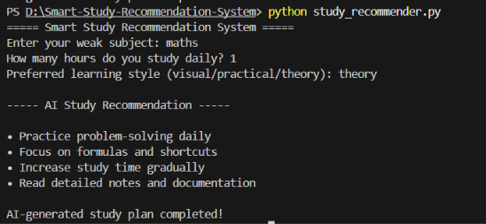

# 📚 Smart Study Recommendation System

## 📌 Description
A beginner-friendly AI-based educational tool that provides personalized study recommendations based on user learning preferences, study hours, and weak subjects.

---

## 🚀 Features
- Subject-based study recommendations
- Personalized learning suggestions
- Study habit improvement tips
- Learning-style based guidance

---

## 🛠️ Technologies Used
- Python

---

## ▶️ How to Run

```bash
python study_recommender.py
```

---

## 📷 Sample Output



---

## 🎯 Future Improvements
- Add GUI interface
- Add chatbot support
- Add quiz generation
- Convert into web application

---

## 👩‍💻 Author
Ragasri S B
